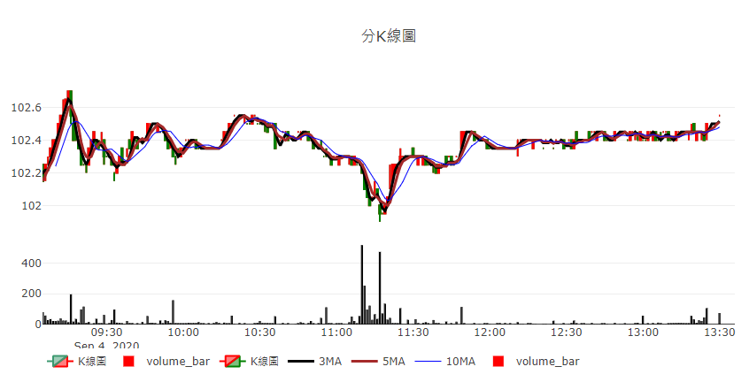

# realtime_websocket

Learning about realtime webstock

## learning part

* Part1
  * intraday
* Part2
  * get_chart_data
  * chart.plot_ohlc
  * chart.plot_volume_bar
  * chart.plot_MA
  * Dash

## Images

Format: 

![image]
(https://github.com/hsuyunyu/realtime_websocket/blob/master/image/demo_part2.png?raw=true)

## Reference
>  [fugle-realtime-demo](https://github.com/fortuna-intelligence/fugle-realtime-demo/).
